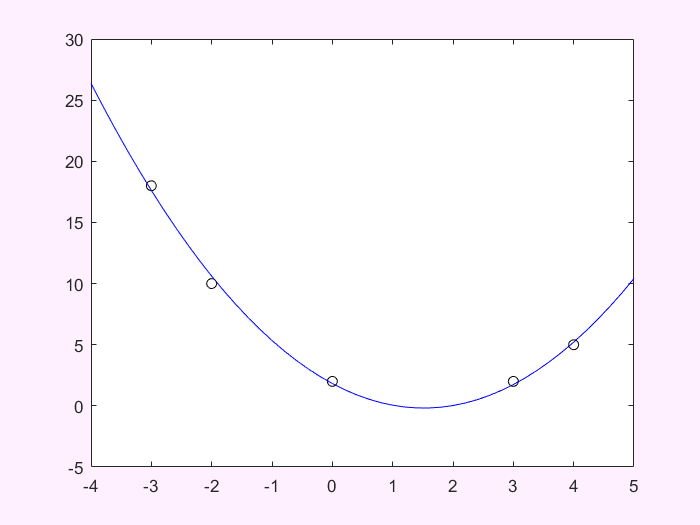
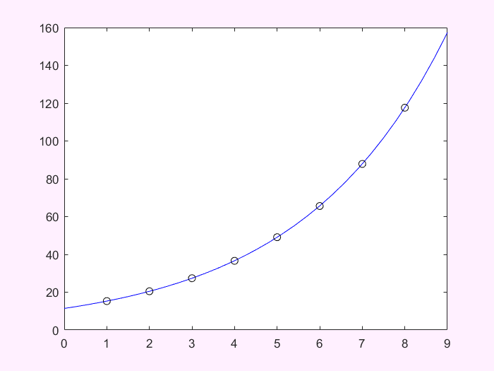

# 第八次习题

## 2 二次拟合

```matlab
x = [-3, -2, 0, 3, 4]; y = [18, 10, 2, 2, 5];
p = polyfit(x, y, 2);
plot(-4:0.2:5, polyval(p, -4:0.2:5), 'b', x, y, 'ko');
```



## 5 指数拟合

```matlab
x = [1, 2, 3, 4, 5, 6, 7, 8]'; y = [15.3, 20.5, 27.4, 36.6, 49.1, 65.6, 87.87, 117.6]';
f = fit(x, y, 'exp1');
plot(0:.3:9, f.a*exp(f.b*(0:.3:9)), 'b', x, y, 'ko');
```



## 8 方程的根(保留三位小数)

$$
4\cos{x} = \exp{x}
$$

以下三种方法的函数见[此处](https://wang-guosheng.github.io/CompPhyExs/sol.html)

* 对分法

```matlab
[sol, it] = dichotomy(@(x)4*cos(x)-exp(x), pi/4, pi/2, 1e-3);
disp([sol, it]);
```
0.9047 10.0000

## 
参见：[MathWorks FileExchange](https://ww2.mathworks.cn/matlabcentral/fileexchange/56560-dichotomy-method)

* 切线法

```matlab
[sol, it] = newtonian_tangent(@(x)4*cos(x)-exp(x), pi/4, 1e-3);
disp([sol, it]);
```

0.9048 3.0000

## 
参见：[MathWorks FileExchange](https://ww2.mathworks.cn/matlabcentral/fileexchange/29721-newton-raphson-method?focused=5192759&tab=function)

* 弦割法

```matlab
[sol, it] = secant_cutting(@(x)4*cos(x)-exp(x), pi/4, pi/2, 1e-3);
disp([sol, it]);
```

0.9048 4.0000

## 
参见：[MathWorks FileExchange](https://ww2.mathworks.cn/matlabcentral/fileexchange/36737-secant-method)

* 指令

```matlab
fzero(@(x)4*cos(x)-exp(x), [pi/4, pi/2], optimset('TolX', 1e-3))
```

## 9 零点和极小值点

```matlab
f=@(x)polyval([1, -4, -6, -16, 4], x);
[x0, fx0] = fzero(f, [-1, 4]);
disp([x0, fx0]);
```
0.2278 0.0000
```matlab
[x0, fx0] = fminbnd(f, -1, 4);
disp([x0, fx0]);
```
4.0000 -156.0000

## 11 解方程

```matlab
a=[3.3330 15920 -10.333;2.2220 16.710 9.6120;1.5611 5.1791 1.6852];
b=[15913; 28.544;8.4252];
linsolve(a,b)
```
ans =
0.9998
1.0000
1.0000

## 链接
* [下载此页对应的实时脚本](https://wang-guosheng.github.io/CompPhyExs/ex8.mlx)
* [下载此页对应的PDF](https://wang-guosheng.github.io/CompPhyExs/ex8.pdf)
* [主页](https://wang-guosheng.github.io/CompPhyExs/main.html)
* [下一页](https://wang-guosheng.github.io/CompPhyExs/ex9.html)